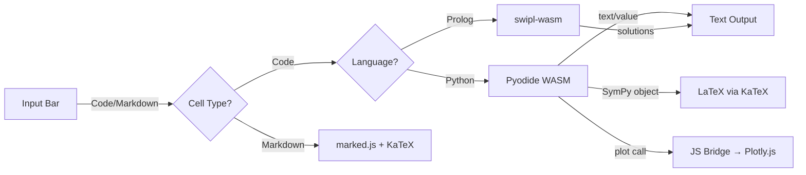

# SciREPL — Mobile Multi-Language Scientific REPL

A **mobile-first** scientific REPL powered by WebAssembly runtimes + Capacitor, with Jupyter-style notebook features. Supports **Python** (Pyodide), **R** (webR), **Prolog** (swipl-wasm), **Bash** (brush-wasm), and **JavaScript** (native).

 

## Features

- **Multi-language notebooks** — Python, R, Prolog, Bash, and JavaScript in the same notebook, with per-cell language tracking
- **Offline Python** via Pyodide (WASM) — NumPy + SymPy preloaded, `%pip install` for PyPI packages
- **SWI-Prolog kernel** — Full SWI-Prolog via swipl-wasm, loaded on demand from CDN
- **Bash kernel** — Unix shell via brush-wasm with coreutils, findutils, grep (all Rust reimplementations)
- **JavaScript kernel** — Native browser JS execution with zero download. Direct access to WASM modules, SharedVFS, and browser APIs
- **R kernel** — Full R via webR (WASM), loaded on demand (~50 MB, cached after first use). Supports plotting, `install.packages()`, and SharedVFS file sharing.
- **Kernel abstraction layer** — Pluggable architecture for adding new language runtimes
- **Package system v2** — Install packages with notebooks, data files, Python modules, Prolog knowledge bases, and WASM libraries. See [docs/packages.md](docs/packages.md).
- **SharedVFS** — In-memory filesystem shared across all kernels. Python, Bash, Prolog, R, and JavaScript can read/write the same files.
- **Cross-kernel WASM FFI** — Package and distribute pre-compiled Rust WASM libraries callable from JavaScript, Python, and Prolog
- **Rich output** — LaTeX math rendering, interactive Plotly charts, tables
- **Hybrid plotting** — Python `plot()` → Plotly.js (pinch-zoom, pan, hover), R `plotly()` → interactive Plotly charts
- **Matplotlib support** — `import matplotlib.pyplot as plt; plt.show()` renders inline PNG images (dark theme)
- **Editable cells** — Click the pencil icon to edit and re-run any cell
- **Delete cells** — Remove individual cells with one click
- **Cell reordering** — Drag-and-drop (desktop) or move up/down arrows (mobile)
- **Markdown cells** — Toggle Code/Md, supports `$LaTeX$` and `$$display math$$`
- **Run All Below / Run All Cells** — Re-execute from a cell downward or the entire notebook
- **Session persistence** — Cells auto-save (with language) and restore on app restart
- **Import/Export** — `.ipynb`, `.py`, `.pl` with language-aware metadata; native share sheet
- **Rich export** — HTML (self-contained or `.html.zip`), Markdown, PDF (print dialog), and DOCX (via docx.js CDN). Exports include code, output, plots, LaTeX math, and tables.
- **Package catalog** — Browse and one-click install curated packages
- **Math Mode palette** — Quick-insert SymPy functions (diff, integrate, solve, etc.)
- **Variable persistence** across cells (like Jupyter)
- **Semicolon suppression** (MATLAB/IPython-style)
- **Command history** — Arrow keys to recall previous inputs
- **Mobile-first UI** — Dark theme, touch-friendly
- **Installable PWA** — Install from browser as a desktop or mobile app, works offline after first load
- **Privacy-first** — Bundled rendering libraries, deferred CDN loading until consent

### Future Features

*Some of these may be offered as part of a Pro version.*

## Quick Start

### Run Locally

```bash
npm run serve
```

Open http://localhost:8085. Wait for Pyodide to load (~30s first time).

### Build for Android

```bash
npm install
npx cap sync
cd android && ./gradlew assembleDebug
```

APK output: `android/app/build/outputs/apk/debug/app-debug.apk`

### Install via ADB

```bash
adb install android/app/build/outputs/apk/debug/app-debug.apk
```

### Install as PWA

Visit [https://s243a.github.io/SciREPL/](https://s243a.github.io/SciREPL/) in your browser, then:

- **Chrome (desktop):** Click the install icon in the address bar, or Menu > "Install SciREPL"
- **Chrome (Android):** Menu > "Add to Home screen" or "Install app"
- **Edge:** Click the install icon in the address bar, or Menu > Apps > "Install this site as an app"
- **Safari (iOS):** Share button > "Add to Home Screen"

Once installed, it runs in its own window and works offline.

## Try It

### Python

```python
# Basic math
2 + 2

# NumPy arrays
import numpy as np
np.linspace(0, 10, 5)

# Plotting
x = np.linspace(0, 2*np.pi, 50)
plot(x, np.sin(x))

# SymPy (LaTeX rendering)
from sympy import symbols, diff, sin
x = symbols('x')
diff(sin(x), x)  # Shows cos(x) as rendered LaTeX

# Suppress output
a = np.arange(1000);
```

### Prolog

Switch to Prolog using the language selector (Py → PL):

```prolog
% Assert facts
assert(parent(tom, bob)).
assert(parent(bob, ann)).

% Query
parent(tom, X).
% → X = bob

% Rules
assert((grandparent(X,Z) :- parent(X,Y), parent(Y,Z))).
grandparent(tom, Z).
% → Z = ann

% Built-in predicates
member(X, [a, b, c]).
% → X = a, X = b, X = c

append([1,2], [3,4], X).
% → X = [1, 2, 3, 4]
```

## How Does SciREPL Compare to Jupyter / Colab?

| | SciREPL | Jupyter Notebook | Google Colab |
|---|---|---|---|
| **Setup** | Zero — visit a URL or install APK | Install Python + pip | Google account |
| **Languages per notebook** | Python, R, Prolog, Bash, JS (per cell) | One kernel per notebook | Python only |
| **Runs offline** | Yes (PWA + WASM) | Needs local server | No |
| **Privacy** | All execution local | Local | Google servers |
| **Mobile support** | Mobile-first + Android app | Not optimized | Usable but not native |
| **Package ecosystem** | `%pip install` (pure-Python PyPI) | Full pip | Full pip |
| **Performance** | WASM (slower for heavy compute) | Native Python | Native + free GPU/TPU |
| **Collaboration** | Single user | JupyterHub | Real-time multi-user |
| **Code completion** | Not yet | Extensions available | Built-in |
| **WASM FFI** | Call Rust WASM from any kernel | No | No |
| **Size** | ~2MB app + CDN runtimes | ~500MB with Anaconda | Cloud-based |

**Why SciREPL?** It's **250x smaller** than a typical Jupyter install (~2MB vs ~500MB), the **only notebook with multi-language cells** (Python, Prolog, Bash, JS in one notebook), and **built for mobile** — not just adapted for it. All with zero setup: visit a URL and go.

**Trade-offs:** WASM Python is slower than native for heavy compute. `%pip install` works for pure-Python packages; C-extension packages need pre-compiled WASM wheels. Not ideal for GPU-accelerated ML training or large datasets.

## Architecture



### Kernel Architecture

```
KernelManager (kernel_manager.js)
├── PythonKernel     (kernels/python.js)      — Pyodide + prelude.py + sharedfs bridge
├── PrologKernel     (kernels/prolog.js)       — swipl-wasm + wasm_call/3
├── BashKernel       (kernels/bash.js)         — brush-wasm (coreutils + findutils + grep)
├── JavaScriptKernel (kernels/javascript.js)   — native browser JS (zero download)
└── RKernel          (kernels/r.js)            — webR (lazy-loaded ~50MB, plotting, SharedVFS, install.packages)
```

Each kernel implements: `init()`, `execute(code)`, `isReady()`, `getName()`, `getLanguage()`, `destroy()`

Kernels are **lazy-loaded** — only downloaded when first used. Python loads at startup; Prolog and Bash load when first used. JavaScript is instant (native browser execution).

### SharedVFS + Package System

```
Package (.zip)  →  PackageLoader  →  target routing
                                      ├── "shared"  →  SharedVFS (/shared/*)
                                      ├── "prolog"  →  Prolog VFS (/user/*)
                                      └── "all"     →  both

SharedVFS (/shared/, /tmp/):
  Bash:    direct access (wasm-bindgen)
  Python:  via sharedfs module (import sharedfs)
  Prolog:  mirrored on read/write
  R:       synced before/after execution (sharedfs_read/write helpers)
  JS:      window.sharedVFS direct access

WASM modules → window.wasmModules[name]
  JS:      window.wasmModules.name.call('func', {args})
  Python:  wasm_call('name', 'func', args)
  Prolog:  wasm_call(name, func, '{"key": "val"}').
```

See [docs/packages.md](docs/packages.md) for full documentation.

### File Structure

- **[www/index.html](www/index.html)** — App shell, language selector, modals, deferred CDN loading
- **[www/css/style.css](www/css/style.css)** — Dark theme, mobile-first layout, language badges
- **[www/js/app.js](www/js/app.js)** — REPL loop, cell management, multi-language execution
- **[www/js/kernel_manager.js](www/js/kernel_manager.js)** — Kernel registry, lazy loading, language switching
- **[www/js/kernels/python.js](www/js/kernels/python.js)** — Python kernel (Pyodide + sharedfs bridge)
- **[www/js/kernels/prolog.js](www/js/kernels/prolog.js)** — Prolog kernel (swipl-wasm + wasm_call/3)
- **[www/js/kernels/bash.js](www/js/kernels/bash.js)** — Bash kernel (brush-wasm)
- **[www/js/kernels/javascript.js](www/js/kernels/javascript.js)** — JavaScript kernel (native browser)
- **[www/js/bridge.js](www/js/bridge.js)** — JS rendering: `renderPlot()`, `renderLatex()`, `renderTable()`
- **[www/js/prelude.py](www/js/prelude.py)** — Python bridge: `plot()`, `mplot()`, `table()`, `wasm_call()`
- **[www/js/sharedfs.py](www/js/sharedfs.py)** — Python SharedVFS bridge (`import sharedfs`)
- **[www/js/r_prelude.R](www/js/r_prelude.R)** — R prelude: SharedVFS bridge + interactive `plotly()` / `mplotly()`
- **[www/js/shared_vfs.js](www/js/shared_vfs.js)** — SharedVFS — in-memory filesystem shared across kernels
- **[www/js/package_loader.js](www/js/package_loader.js)** — Package loading, target routing, WASM module loading
- **[www/js/package_catalog.js](www/js/package_catalog.js)** — Browse Packages UI and one-click install
- **[www/js/persistence.js](www/js/persistence.js)** — Session save/restore via localStorage (with language per cell)
- **[www/js/export.js](www/js/export.js)** — HTML, Markdown, PDF, and DOCX export with DOM scraping
- **[www/js/file_io.js](www/js/file_io.js)** — Import/export (.ipynb, .py, .pl, packages) via Capacitor plugins
- **[www/js/math_mode.js](www/js/math_mode.js)** — Math palette UI
- **[www/vendor/](www/vendor/)** — Bundled KaTeX, Plotly.js, marked.js (~2.6MB)
- **[docs/packages.md](docs/packages.md)** — Package system v2 documentation

### Capacitor Plugins

- `@capacitor/filesystem` — Write export files to device storage
- `@capacitor/share` — Native share sheet for file export

### CDN Dependencies (loaded at runtime)

| Runtime | CDN | Size | When loaded |
|---------|-----|------|-------------|
| Pyodide | cdn.jsdelivr.net | ~25MB | App startup (after privacy consent) |
| swipl-wasm | SWI-Prolog.github.io | ~10MB | First Prolog cell execution |
| webR | webr.r-wasm.org | ~50MB | First R cell execution |

## Roadmap

- [x] Multi-language support (Python + Prolog + Bash)
- [x] Kernel abstraction layer
- [x] Privacy-first CDN loading (consent before download)
- [x] Bundled rendering libraries
- [x] Package system v2 — target routing, binary support, SharedVFS
- [x] Python SharedVFS bridge (`import sharedfs`)
- [x] R SharedVFS bridge (`sharedfs_read`, `sharedfs_write`) + `install.packages()` support
- [x] Cross-kernel WASM FFI (Python + Prolog can call WASM modules)
- [x] Package catalog with one-click install
- [x] JavaScript kernel (native browser, zero download)
- [x] PWA — installable as desktop/mobile app, offline support, WASM runtime caching
- [x] R kernel via webR (lazy-loaded, plotting, SharedVFS, package install)
- [x] Matplotlib inline backend (`plt.show()` renders PNG images)
- [x] Interactive R plots via `plotly()` / `mplotly()` helpers
- [x] Rich export — HTML (embedded / `.html.zip`), Markdown, PDF (print dialog), DOCX (docx.js CDN)
- [ ] Additional languages (Lua)
- [x] Cell reordering (drag-and-drop + move arrows)
- [x] Delete individual cells

## License

MIT License — see [LICENSE](LICENSE)

## Credits

Built with:
- [Pyodide](https://pyodide.org/) — Python in the browser
- [swipl-wasm](https://github.com/SWI-Prolog/npm-swipl-wasm) — SWI-Prolog in the browser
- [Plotly.js](https://plotly.com/javascript/) — Interactive charts
- [KaTeX](https://katex.org/) — LaTeX rendering
- [marked.js](https://marked.js.org/) — Markdown parsing
- [Capacitor](https://capacitorjs.com/) — Native mobile builds
