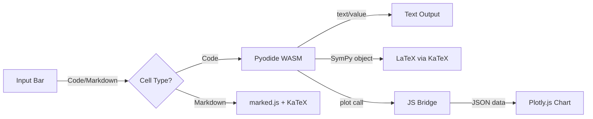

# SciREPL Pro — Mobile Scientific Python REPL

> **Note:** This is the **premium/Pro** version of SciREPL. The free open-source version is at [s243a/SciREPL](https://github.com/s243a/SciREPL).

A **mobile-first** Python REPL powered by Pyodide + Capacitor, with Jupyter-style notebook features.

 

## Features

### Core (shared with free version)
- **Offline Python** via Pyodide (WASM)
- **Rich output**: LaTeX math rendering, interactive Plotly charts, tables
- **NumPy + SymPy** preloaded
- **Hybrid plotting**: Python `plot()` → Plotly.js (pinch-zoom, pan, hover)
- **Variable persistence** across cells (like Jupyter)
- **Semicolon suppression** (MATLAB/IPython-style)
- **Mobile-first UI**: Dark theme, touch-friendly

### Pro Features
- **Editable cells** — Click the pencil icon to edit and re-run any cell
- **Markdown cells** — Toggle Code/Md, supports `$LaTeX$` and `$$display math$$`
- **Run All Below** — Re-execute from a cell downward
- **Run All Cells** — Re-run the entire notebook
- **Session persistence** — Cells auto-save and restore on app restart
- **Export as .ipynb** — Native share sheet (save to Files, Drive, email, etc.)
- **Import .ipynb** — Creates and executes cells (code + markdown)
- **Import .py** — Load Python scripts into the input bar
- **Math Mode palette** — Quick-insert SymPy functions (diff, integrate, solve, etc.)
- **Command history** — Arrow keys to recall previous inputs

## Quick Start

### Run Locally

```bash
npm run serve
```

Open http://localhost:8085. Wait for Pyodide to load (~30s first time).

### Build for Android

```bash
npm install
npx cap sync
cd android && ./gradlew assembleDebug
```

APK output: `android/app/build/outputs/apk/debug/app-debug.apk`

### Install via ADB

```bash
adb install android/app/build/outputs/apk/debug/app-debug.apk
```

## Try It

```python
# Basic math
2 + 2

# NumPy arrays
import numpy as np
np.linspace(0, 10, 5)

# Plotting
x = np.linspace(0, 2*np.pi, 50)
plot(x, np.sin(x))

# SymPy (LaTeX rendering)
from sympy import symbols, diff, sin
x = symbols('x')
diff(sin(x), x)  # Shows cos(x) as rendered LaTeX

# Suppress output
a = np.arange(1000);
```

## Architecture



### File Structure

- **[www/index.html](www/index.html)** — App shell, CDN loads, modals
- **[www/css/style.css](www/css/style.css)** — Dark theme, mobile-first layout
- **[www/js/app.js](www/js/app.js)** — REPL loop, cell management, session restore, import
- **[www/js/bridge.js](www/js/bridge.js)** — JS rendering: `renderPlot()`, `renderLatex()`, `renderTable()`
- **[www/js/prelude.py](www/js/prelude.py)** — Python bridge: `plot()`, `mplot()`, `table()`, pre-imports
- **[www/js/persistence.js](www/js/persistence.js)** — Session save/restore via localStorage
- **[www/js/file_io.js](www/js/file_io.js)** — Import/export (.ipynb, .py) via Capacitor plugins
- **[www/js/math_mode.js](www/js/math_mode.js)** — Math palette UI

### Capacitor Plugins

- `@capacitor/filesystem` — Write export files to device storage
- `@capacitor/share` — Native share sheet for file export

## Roadmap

- [ ] Multi-language support (Prolog via swipl-wasm, R via webR)
- [ ] Cache management for WASM runtimes
- [ ] PWA manifest (install without app stores)
- [ ] Matplotlib backend fallback
- [ ] Cell reordering (drag and drop)
- [ ] Delete individual cells

## License

MIT License — see [LICENSE](LICENSE)

## Credits

Built with:
- [Pyodide](https://pyodide.org/) — Python in the browser
- [Plotly.js](https://plotly.com/javascript/) — Interactive charts
- [KaTeX](https://katex.org/) — LaTeX rendering
- [marked.js](https://marked.js.org/) — Markdown parsing
- [Capacitor](https://capacitorjs.com/) — Native mobile builds
