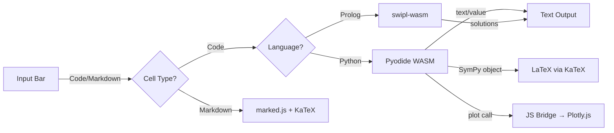

# SciREPL Pro — Mobile Multi-Language Scientific REPL

> **Note:** This is the **premium/Pro** version of SciREPL. The free open-source version is at [s243a/SciREPL](https://github.com/s243a/SciREPL).

A **mobile-first** scientific REPL powered by WebAssembly runtimes + Capacitor, with Jupyter-style notebook features. Supports **Python** (Pyodide) and **Prolog** (swipl-wasm), with more languages planned.

 

## Features

### Core (shared with free version)
- **Offline Python** via Pyodide (WASM)
- **Rich output**: LaTeX math rendering, interactive Plotly charts, tables
- **NumPy + SymPy** preloaded
- **Hybrid plotting**: Python `plot()` → Plotly.js (pinch-zoom, pan, hover)
- **Variable persistence** across cells (like Jupyter)
- **Semicolon suppression** (MATLAB/IPython-style)
- **Mobile-first UI**: Dark theme, touch-friendly

### Pro Features
- **Multi-language support** — Python and Prolog in the same notebook, with per-cell language tracking
- **SWI-Prolog kernel** — Full SWI-Prolog via swipl-wasm, loaded on demand from CDN
- **Kernel abstraction layer** — Pluggable architecture for adding new language runtimes
- **Editable cells** — Click the pencil icon to edit and re-run any cell
- **Markdown cells** — Toggle Code/Md, supports `$LaTeX$` and `$$display math$$`
- **Run All Below** — Re-execute from a cell downward
- **Run All Cells** — Re-run the entire notebook
- **Session persistence** — Cells auto-save (with language) and restore on app restart
- **Export as .ipynb** — Language-aware metadata, native share sheet
- **Import .ipynb / .py / .pl** — Creates and executes cells with correct language
- **Math Mode palette** — Quick-insert SymPy functions (diff, integrate, solve, etc.)
- **Command history** — Arrow keys to recall previous inputs
- **Privacy-first** — Bundled rendering libraries, deferred CDN loading until consent

## Quick Start

### Run Locally

```bash
npm run serve
```

Open http://localhost:8085. Wait for Pyodide to load (~30s first time).

### Build for Android

```bash
npm install
npx cap sync
cd android && ./gradlew assembleDebug
```

APK output: `android/app/build/outputs/apk/debug/app-debug.apk`

### Install via ADB

```bash
adb install android/app/build/outputs/apk/debug/app-debug.apk
```

## Try It

### Python

```python
# Basic math
2 + 2

# NumPy arrays
import numpy as np
np.linspace(0, 10, 5)

# Plotting
x = np.linspace(0, 2*np.pi, 50)
plot(x, np.sin(x))

# SymPy (LaTeX rendering)
from sympy import symbols, diff, sin
x = symbols('x')
diff(sin(x), x)  # Shows cos(x) as rendered LaTeX

# Suppress output
a = np.arange(1000);
```

### Prolog

Switch to Prolog using the language selector (Py → PL):

```prolog
% Assert facts
assert(parent(tom, bob)).
assert(parent(bob, ann)).

% Query
parent(tom, X).
% → X = bob

% Rules
assert((grandparent(X,Z) :- parent(X,Y), parent(Y,Z))).
grandparent(tom, Z).
% → Z = ann

% Built-in predicates
member(X, [a, b, c]).
% → X = a, X = b, X = c

append([1,2], [3,4], X).
% → X = [1, 2, 3, 4]
```

## Architecture



### Kernel Architecture

```
KernelManager (kernel_manager.js)
├── PythonKernel (kernels/python.js)  — Pyodide + prelude.py
└── PrologKernel (kernels/prolog.js)  — swipl-wasm via dynamic import
```

Each kernel implements: `init()`, `execute(code)`, `isReady()`, `getName()`, `getLanguage()`, `destroy()`

Kernels are **lazy-loaded** — only downloaded when first used. Python loads at startup; Prolog loads when the user first switches to PL.

### File Structure

- **[www/index.html](www/index.html)** — App shell, language selector, modals, deferred CDN loading
- **[www/css/style.css](www/css/style.css)** — Dark theme, mobile-first layout, language badges
- **[www/js/app.js](www/js/app.js)** — REPL loop, cell management, multi-language execution
- **[www/js/kernel_manager.js](www/js/kernel_manager.js)** — Kernel registry, lazy loading, language switching
- **[www/js/kernels/python.js](www/js/kernels/python.js)** — Python kernel (Pyodide wrapper)
- **[www/js/kernels/prolog.js](www/js/kernels/prolog.js)** — Prolog kernel (swipl-wasm wrapper)
- **[www/js/bridge.js](www/js/bridge.js)** — JS rendering: `renderPlot()`, `renderLatex()`, `renderTable()`
- **[www/js/prelude.py](www/js/prelude.py)** — Python bridge: `plot()`, `mplot()`, `table()`, pre-imports
- **[www/js/persistence.js](www/js/persistence.js)** — Session save/restore via localStorage (with language per cell)
- **[www/js/file_io.js](www/js/file_io.js)** — Import/export (.ipynb, .py, .pl) via Capacitor plugins
- **[www/js/math_mode.js](www/js/math_mode.js)** — Math palette UI
- **[www/vendor/](www/vendor/)** — Bundled KaTeX, Plotly.js, marked.js (~2.6MB)

### Capacitor Plugins

- `@capacitor/filesystem` — Write export files to device storage
- `@capacitor/share` — Native share sheet for file export

### CDN Dependencies (loaded at runtime)

| Runtime | CDN | Size | When loaded |
|---------|-----|------|-------------|
| Pyodide | cdn.jsdelivr.net | ~25MB | App startup (after privacy consent) |
| swipl-wasm | SWI-Prolog.github.io | ~10MB | First Prolog cell execution |

## Roadmap

- [x] Multi-language support (Python + Prolog)
- [x] Kernel abstraction layer
- [x] Privacy-first CDN loading (consent before download)
- [x] Bundled rendering libraries
- [ ] Additional languages (R via webR, Lua)
- [ ] Cache management for WASM runtimes
- [ ] PWA manifest (install without app stores)
- [ ] Matplotlib backend fallback
- [ ] Cell reordering (drag and drop)
- [ ] Delete individual cells

## License

MIT License — see [LICENSE](LICENSE)

## Credits

Built with:
- [Pyodide](https://pyodide.org/) — Python in the browser
- [swipl-wasm](https://github.com/SWI-Prolog/npm-swipl-wasm) — SWI-Prolog in the browser
- [Plotly.js](https://plotly.com/javascript/) — Interactive charts
- [KaTeX](https://katex.org/) — LaTeX rendering
- [marked.js](https://marked.js.org/) — Markdown parsing
- [Capacitor](https://capacitorjs.com/) — Native mobile builds
