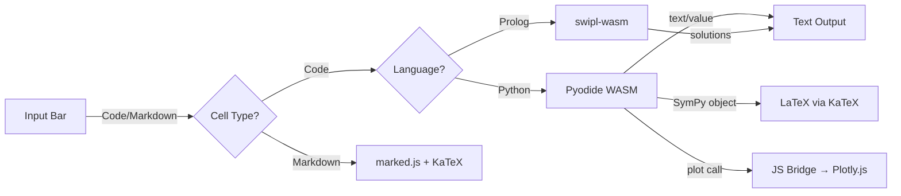

# SciREPL — Mobile Multi-Language Scientific REPL

A mobile-first, multi-language scientific notebook powered by browser and WebAssembly runtimes. The Free edition supports **Python** (Pyodide), **R** (webR), **Prolog** (swipl-wasm), **Bash** (brush-wasm), **JavaScript**, **Lua** (Fengari), **TypR**, and **ClojureScript** (Scittle).


## Editions and downloads

- **SciREPL Free for Android:** [Google Play](https://play.google.com/store/apps/details?id=com.unifyweaver.scirepl) or the [Free GitHub releases](https://github.com/s243a/SciREPL/releases). The same Free notebook is available as an [installable browser app (PWA)](https://s243a.github.io/SciREPL/).
- **SciREPL Pro for Android:** [Google Play](https://play.google.com/store/apps/details?id=com.unifyweaver.scirepl.pro). Pro adds optional AI and remote-agent features. The [Pro website](https://s243a.github.io/SciREPL/pro/) has information and release notes; it is **not** a hosted Pro app.
- **Free Windows portable preview:** see [setup and limitations](docs/WINDOWS_PREVIEW.md).

Access to Play test builds may require joining the tester group; see the [Android testing instructions for both editions](https://s243a.github.io/SciREPL/pro/testing.html).

## Help and documentation

Start with the public [SciREPL Help](https://s243a.github.io/SciREPL/help/). Shared Free-and-Pro topics come first; Pro-only extensions are grouped and labelled separately. This README continues with developer-oriented build and architecture details.

## Features

- **Multi-language notebooks** — Python, R, Prolog, Bash, JavaScript, Lua, TypR, and ClojureScript in the same notebook, with per-cell language tracking
- **Offline Python** via Pyodide (WASM) — NumPy + SymPy preloaded, `%pip install` for PyPI packages
- **SWI-Prolog kernel** — Full SWI-Prolog via bundled swipl-wasm, available offline in the standard Free release
- **Bash kernel** — Unix shell via brush-wasm with coreutils, findutils, grep (all Rust reimplementations)
- **JavaScript kernel** — Native browser JS execution with zero download. Direct access to WASM modules, SharedVFS, and browser APIs
- **Lua kernel** — Lua via Fengari, with `nb.read()`, `nb.write()`, `nb.list()`, and `nb.name()` access to notebook cells
- **R kernel** — Full R via webR (WASM), loaded on demand (~50 MB, cached after first use). Supports plotting, `install.packages()`, and SharedVFS file sharing.
- **TypR kernel** — Typed R superset via typr-wasm (~2.5 MB). Compiles TypR to R, then executes through webR. Supports `#!typecheck`, `#!transpile`, and `#!show-r` directives.
- **Named source-only cells** — TypR and Lua cells beginning with `#!source` remain highlighted and VFS-readable without executing or producing an output card
- **Kernel abstraction layer** — Pluggable architecture for adding new language runtimes
- **Package system v2** — Install packages with notebooks, data files, Python modules, Prolog knowledge bases, and WASM libraries. See [docs/packages.md](docs/packages.md).
- **SharedVFS** — In-memory filesystem shared across all kernels. Python, Bash, Prolog, R, and JavaScript can read/write the same files. Persisted to IndexedDB — files survive page reloads.
- **Cross-kernel WASM FFI** — Package and distribute pre-compiled Rust WASM libraries callable from JavaScript, Python, and Prolog
- **Rich output** — LaTeX math rendering, interactive Plotly charts, tables
- **Hybrid plotting** — Python `plot()` → Plotly.js (pinch-zoom, pan, hover), R `plotly()` → interactive Plotly charts
- **Matplotlib support** — `import matplotlib.pyplot as plt; plt.show()` renders inline PNG images
- **Syntax highlighting** — Code cells display with keyword coloring via highlight.js (Python, JavaScript, R, Bash, Prolog)
- **Find & Replace** — `Ctrl+F` / `Cmd+F` or header search button (mobile-friendly) to search across all cells with match navigation and replace
- **Editable cells** — Click the pencil icon to edit and re-run any cell
- **Delete cells** — Remove individual cells with one click
- **Cell reordering** — Drag-and-drop (desktop) or move up/down arrows (mobile)
- **Markdown cells** — Toggle Code/Md, supports `$LaTeX$` and `$$display math$$`
- **Run All Below / Run All Cells** — Re-execute from a cell downward or the entire notebook
- **File browser** — Browse, download, create folders, and manage files across all filesystems. Upload files to any folder, extract zip archives, or upload them as whole files.
- **Multi-notebook tabs** — Multiple notebooks in tabs/sidebar/dropdown. Import a workbook to create a new tab. Double-click tab names to rename.
- **Session persistence** — Cells auto-save (with language) and restore on app restart. SharedVFS files persist to IndexedDB.
- **Import/Export** — `.ipynb`, `.py`, `.pl` with language-aware metadata; native share sheet
- **Rich export** — HTML, Markdown, PDF, DOCX, and LaTeX via Export modal with theme (dark/light/browser default), page background, and image handling options. Exports include code, output, plots, LaTeX math, and tables. HTML and DOCX exports include syntax-highlighted code blocks.
- **Import/Export with outputs** — `.ipynb` export includes cell outputs (text, images, LaTeX, tables), viewable in Jupyter and GitHub without re-execution. Import preserves outputs — no re-execution needed.
- **Verified package catalogue** — Browse and one-click install bundled items
  plus integrity-checked SciREPL Catalog release workbooks; choose latest
  stable, a release, a full commit, or an explicitly volatile branch. See
  [catalogue sources](docs/CATALOG_SOURCES.md) for platform behavior.
- **Math Mode palette** — Quick-insert SymPy functions (diff, integrate, solve, etc.)
- **Variable persistence** across cells (like Jupyter)
- **Semicolon suppression** (MATLAB/IPython-style)
- **Command history** — Arrow keys to recall previous inputs
- **Mobile-first UI** — Touch-friendly controls with system, dark, light, and custom themes
- **Installable PWA** — Install from a browser on desktop or mobile; bundled and previously cached components work offline
- **Network choices** — Core Free runtimes are bundled in standard releases; R, Lua, package downloads, catalogue access, and network calls made by notebook code can require a connection. See the [privacy policy](www/privacy.html).
- **Lazy kernel initialization** — Kernels start when needed. The standard Free release bundles Python, Prolog, ClojureScript, Bash, and TypR; R and Lua download on first use.
- **Settings menu** — Configure auto-execute on import, delete confirmation, export format (.zip/.tar/.tar.gz), auto-download runtimes, auto-switch workbook on install, large touch targets, default language

## Quick Start

### Run Locally

```bash
npm ci
npm run serve
```

Open http://localhost:8085. For offline testing that matches the standard Free release, run `npm run fetch:bundles` before starting the server; an unprepared checkout can fall back to the network for large runtimes.

### Build for Android

```bash
npm ci
npm run build:debug
```

This requires the Android SDK and Java toolchain. The build command prepares the bundled runtimes and Capacitor project before Gradle runs. APK output: `android/app/build/outputs/apk/debug/app-debug.apk`.

### Install via ADB

```bash
adb install android/app/build/outputs/apk/debug/app-debug.apk
```

### Install as PWA

Visit [https://s243a.github.io/SciREPL/](https://s243a.github.io/SciREPL/) in your browser, then:

- **Chrome (desktop):** Click the install icon in the address bar, or Menu > "Install SciREPL"
- **Chrome (Android):** Menu > "Add to Home screen" or "Install app"
- **Edge:** Click the install icon in the address bar, or Menu > Apps > "Install this site as an app"
- **Safari (iOS):** Share button > "Add to Home Screen"

Once installed, it runs in its own window. The app shell and bundled or cached runtimes work offline; first use of R or Lua and optional network features still requires a connection.

## Try It

### Python

```python
# Basic math
2 + 2

# NumPy arrays
import numpy as np
np.linspace(0, 10, 5)

# Plotting
x = np.linspace(0, 2*np.pi, 50)
plot(x, np.sin(x))

# SymPy (LaTeX rendering)
from sympy import symbols, diff, sin
x = symbols('x')
diff(sin(x), x)  # Shows cos(x) as rendered LaTeX

# Suppress output
a = np.arange(1000);
```

### Prolog

Switch to Prolog using the language selector (Py → PL):

```prolog
% Assert facts
assert(parent(tom, bob)).
assert(parent(bob, ann)).

% Query
parent(tom, X).
% → X = bob

% Rules
assert((grandparent(X,Z) :- parent(X,Y), parent(Y,Z))).
grandparent(tom, Z).
% → Z = ann

% Built-in predicates
member(X, [a, b, c]).
% → X = a, X = b, X = c

append([1,2], [3,4], X).
% → X = [1, 2, 3, 4]
```

### R

Switch to R using the language selector (Py → R). First use downloads webR (~50 MB, cached after):

```r
# Basic math
x <- seq(0, 2*pi, length.out=50)
sin(x)

# Data frames
df <- data.frame(name=c("Alice","Bob"), score=c(95, 87))
df

# Interactive plotting
plotly(x, sin(x), title="Sine Wave")

# Install packages
install.packages("jsonlite")
library(jsonlite)
```

### Bash

Switch to Bash using the language selector (Py → Bash):

```bash
# Unix commands via brush-wasm
echo "Hello from Bash!"
seq 1 10 | head -5

# File operations (SharedVFS)
echo "data" > /shared/test.txt
cat /shared/test.txt

# Pipes and filters
echo -e "banana\napple\ncherry" | sort
```

### JavaScript

Switch to JavaScript using the language selector (Py → JS):

```javascript
// Native browser JS — zero download
const x = Array.from({length: 50}, (_, i) => i * 0.1);
const y = x.map(v => Math.sin(v));

// Access SharedVFS
window.sharedVFS.write('/shared/hello.txt', 'from JS');

// Use any browser API
JSON.stringify({pi: Math.PI, e: Math.E}, null, 2)
```

## What to expect

SciREPL lets you mix languages cell by cell on a phone or in a browser. Notebook kernels execute locally, and saved workbooks and virtual files stay on the device unless you choose to export them or use a network feature. The Free PWA, Android app, and Windows preview share the notebook interface, though platform-specific file and sharing features differ.

WebAssembly runtimes can be slower than native tools for heavy computation. `%pip install` supports packages compatible with Pyodide; packages that need native extensions require compatible WebAssembly wheels. R and Lua need a first-use download, while catalogue access, package installs, and network calls made by notebook code can also use the network. See [platform and offline details](https://s243a.github.io/SciREPL/help/) before relying on the app without a connection.

## Architecture



### Kernel Architecture

```
KernelManager (kernel_manager.js)
├── PythonKernel     (kernels/python.js)      — Pyodide + prelude.py + sharedfs bridge
├── PrologKernel     (kernels/prolog.js)       — swipl-wasm + wasm_call/3
├── BashKernel       (kernels/bash.js)         — brush-wasm (coreutils + findutils + grep)
├── JavaScriptKernel (kernels/javascript.js)   — native browser JS (zero download)
├── RKernel          (kernels/r.js)            — webR (lazy-loaded ~50MB, plotting, SharedVFS, install.packages)
├── LuaKernel        (kernels/lua.js)          — Fengari + notebook cell access
├── ClojureScriptKernel (kernels/clojurescript.js) — bundled Scittle
└── TypRKernel       (kernels/typr.js)         — typr-wasm (2.5MB) → R transpilation → webR execution
```

Each kernel implements: `init()`, `execute(code)`, `isReady()`, `getName()`, `getLanguage()`, `destroy()`

Kernels are **lazy-initialized** when first used. The standard Free profile
loads its bundled runtimes locally; R and Lua require the network on first use.
Privacy consent and download confirmation are shown before a runtime CDN
download. JavaScript and Bash initialize without a CDN request.

### SharedVFS + Package System

```
Package (.zip)  →  PackageLoader  →  target routing
                                      ├── "shared"  →  SharedVFS (/shared/*)
                                      ├── "prolog"  →  Prolog VFS (/user/*)
                                      └── "all"     →  both

SharedVFS (/shared/, /tmp/):
  Bash:    direct access (wasm-bindgen)
  Python:  via sharedfs module (import sharedfs)
  Prolog:  mirrored on read/write
  R:       synced before/after execution (sharedfs_read/write helpers)
  JS:      window.sharedVFS direct access

WASM modules → window.wasmModules[name]
  JS:      window.wasmModules.name.call('func', {args})
  Python:  wasm_call('name', 'func', args)
  Prolog:  wasm_call(name, func, '{"key": "val"}').
```

See [docs/packages.md](docs/packages.md) for full documentation.

### File Structure

- **[www/index.html](www/index.html)** — App shell, language selector, modals, deferred CDN loading
- **[www/css/style.css](www/css/style.css)** — Mobile-first layout, themes, language badges
- **[www/js/app.js](www/js/app.js)** — REPL loop, cell management, multi-language execution
- **[www/js/kernel_manager.js](www/js/kernel_manager.js)** — Kernel registry, lazy loading, language switching
- **[www/js/kernels/python.js](www/js/kernels/python.js)** — Python kernel (Pyodide + sharedfs bridge)
- **[www/js/kernels/prolog.js](www/js/kernels/prolog.js)** — Prolog kernel (swipl-wasm + wasm_call/3)
- **[www/js/kernels/bash.js](www/js/kernels/bash.js)** — Bash kernel (brush-wasm)
- **[www/js/kernels/javascript.js](www/js/kernels/javascript.js)** — JavaScript kernel (native browser)
- **[www/js/kernels/typr.js](www/js/kernels/typr.js)** — TypR kernel (typr-wasm → webR transpiler pipeline)
- **[www/js/bridge.js](www/js/bridge.js)** — JS rendering: `renderPlot()`, `renderLatex()`, `renderTable()`
- **[www/js/prelude.py](www/js/prelude.py)** — Python bridge: `plot()`, `mplot()`, `table()`, `wasm_call()`
- **[www/js/sharedfs.py](www/js/sharedfs.py)** — Python SharedVFS bridge (`import sharedfs`)
- **[www/js/r_prelude.R](www/js/r_prelude.R)** — R prelude: SharedVFS bridge + interactive `plotly()` / `mplotly()`
- **[www/js/shared_vfs.js](www/js/shared_vfs.js)** — SharedVFS — in-memory filesystem shared across kernels
- **[www/js/package_loader.js](www/js/package_loader.js)** — Package loading, target routing, WASM module loading
- **[www/js/package_catalog.js](www/js/package_catalog.js)** — Packages, dependency-aware bundles, workbooks, and installed-state UI
- **[www/js/catalog_source.js](www/js/catalog_source.js)** — Verified remote catalogue channels, release pinning, bounded fetches, and offline cache
- **[www/js/persistence.js](www/js/persistence.js)** — Session save/restore via localStorage + IndexedDB (with language per cell)
- **[www/js/indexeddb_store.js](www/js/indexeddb_store.js)** — IndexedDB storage for Prolog VFS and SharedVFS files
- **[www/js/notebook_manager.js](www/js/notebook_manager.js)** — Multi-notebook management (tabs/sidebar/dropdown, rename, persistence)
- **[www/js/export.js](www/js/export.js)** — HTML, Markdown, PDF, DOCX, and LaTeX export with DOM scraping and syntax highlighting
- **[www/js/file_io.js](www/js/file_io.js)** — Import/export (.ipynb with output preservation, .py, .pl, packages) via Capacitor plugins
- **[www/js/math_mode.js](www/js/math_mode.js)** — Math palette UI
- **[www/vendor/](www/vendor/)** — Bundled rendering libraries and selected language runtimes; large WASM bundles are fetched during release preparation
- **[docs/packages.md](docs/packages.md)** — Package system v2 documentation

### Capacitor Plugins

- `@capacitor/filesystem` — Write export files to device storage
- `@capacitor/share` — Native share sheet for file export

### Optional network-loaded components

The standard Free release bundles Python/Pyodide, SWI-Prolog, ClojureScript,
Bash, TypR, JavaScript, and the application interface. These components may
still use the network when notebook code explicitly installs packages or fetches
data. The following optional components are downloaded only when requested:

| Component | Source | Approximate size | When loaded |
|-----------|--------|------------------|-------------|
| webR | webr.r-wasm.org (with exact-version mirrors where configured) | ~50MB | First R cell execution |
| Fengari | cdn.jsdelivr.net or unpkg.com | ~200KB | First Lua cell execution |
| DOCX export library | cdn.jsdelivr.net | varies | First DOCX export |

Runtime-version metadata is checked separately through jsDelivr only after the
current network privacy policy has been accepted. A version check does not
download or activate the runtime.

## Development status

The feature list above describes the Free edition in this repository. For shipped changes, see the [Free releases](https://github.com/s243a/SciREPL/releases). [Open pull requests](https://github.com/s243a/SciREPL/pulls) may contain experimental work; they are not promises about the next release. Earlier, unprioritized ideas are preserved in [docs/IDEAS.md](docs/IDEAS.md). The public [Help site](https://s243a.github.io/SciREPL/help/) distinguishes shared features from Pro-only features.

## Testing

### Playwright Tests

SciREPL includes Playwright tests that verify cross-cell communication (Notebook VFS) examples across all six kernels.

```bash
# Start local server
npm run serve

# Run all VFS tests
npx playwright install chromium   # first time only
node tests/test_help_vfs_examples.mjs
```

#### WSL2 Memory Requirements

Large WebAssembly kernels (Python/Pyodide, R/webR, Prolog/SWI-WASM) compile
inside the browser regardless of whether their assets came from the app bundle
or a CDN. This requires significant memory:

| Component | Memory Usage |
|-----------|-------------|
| Chromium (headless) | ~200–400 MB resident |
| Pyodide WASM compilation | ~3–4 GB peak (bundled runtime and standard library → JIT compile) |
| webR WASM compilation | ~1–2 GB peak |
| SWI-Prolog WASM compilation | ~500 MB–1 GB peak |
| Node.js (Playwright host) | ~100–200 MB |

When running tests on **WSL2**, the default memory and swap allocation (typically 50% of host RAM / ~1 GB swap) is often insufficient. The Linux OOM killer will terminate the browser process mid-compilation.

**Recommended `.wslconfig`** (edit `C:\Users\<username>\.wslconfig`, then `wsl --shutdown`):

```ini
[wsl2]
memory=5GB
swap=5GB
```

- **5 GB RAM** gives enough headroom for Chromium + one large WASM module with room for the OS
- **5 GB swap** acts as overflow when peak WASM compilation temporarily exceeds physical RAM — the kernel spills pages to swap instead of OOM-killing

Without adequate swap, Pyodide compilation reliably triggers the OOM killer at ~4 GB RSS, even with 5 GB total RAM.

#### Playwright + Large WASM: DOM Signaling Pattern

Standard `page.evaluate()` calls fail with `ERR_STRING_TOO_LONG` after loading large WASM modules (Pyodide, webR). This is a Node.js/Playwright limitation: the Chrome DevTools Protocol serializes the full execution context, and when WASM memory is large, the resulting message exceeds Node's maximum string size (~512 MB).

**Workaround:** Use `page.addScriptTag()` to inject code and DOM `data-*` attributes to pass results back:

```javascript
// Instead of: const result = await page.evaluate(() => heavyWasmCall());
// Do this:
await page.addScriptTag({ content: `
    heavyWasmCall()
        .then(r => document.body.setAttribute('data-result', JSON.stringify(r)))
        .catch(e => document.body.setAttribute('data-error', e.message));
`});
await page.waitForFunction(
    () => document.body.hasAttribute('data-result') || document.body.hasAttribute('data-error'),
    { timeout: 300000, polling: 2000 }
);
const result = JSON.parse(await page.getAttribute('body', 'data-result'));
```

This pattern is used in `tests/test_help_vfs_examples.mjs` for large-kernel tests.

## License

MIT License — see [LICENSE](LICENSE)

Third-party components retain their own licences. See
[THIRD_PARTY_NOTICES.md](THIRD_PARTY_NOTICES.md) for the generated direct/grouped
inventory, exact tested runtime versions, sources, and local licence-text links.
The same notices are available offline from **Help → Open-source licences** in
the app. This inventory is intentionally not described as a complete transitive
SBOM; packages installed later by a user retain their own licences.

## Credits

Built with:
- [Pyodide](https://pyodide.org/) — Python in the browser
- [swipl-wasm](https://github.com/SWI-Prolog/npm-swipl-wasm) — SWI-Prolog in the browser
- [Plotly.js](https://plotly.com/javascript/) — Interactive charts
- [KaTeX](https://katex.org/) — LaTeX rendering
- [marked.js](https://marked.js.org/) — Markdown parsing
- [Capacitor](https://capacitorjs.com/) — Native mobile builds
